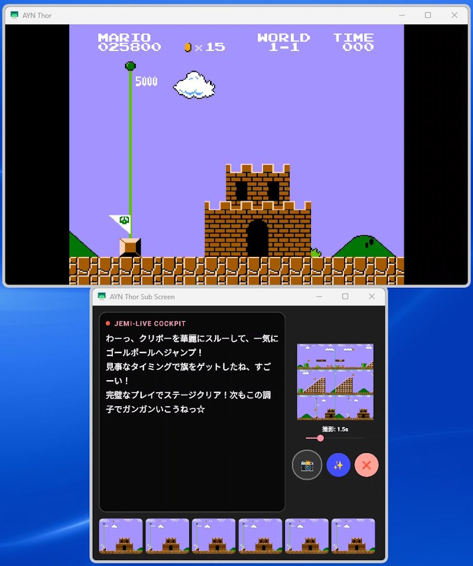

# Jemi-Live AI実況アプリ

## ■機能

画面上のゲームシーン（主にレトロゲーム）をGeminiモデルのAPIを使用して実況、翻訳、攻略、解説、情報、裏話をしてくれるAndroidアプリ。AYN Thor用にカスタマイズされた2画面仕様（上画面はゲーム画面、下画面は実況用コックピット画面）に対応。

## ■実行イメージ

## 

## ■GitHub

[https://github.com/kitayoshi47/Jemi-Live](https://github.com/kitayoshi47/Jemi-Live)

## ■仕様

### 【スペック】

使用モデル：Gemini 3.1 Flash-Lite  
動作環境：AYN Thor Base 8GB

### 【基本機能】

　メイン画面を定期的にキャプチャーして縮小バッファに保持、時系列順に2x3マスのタイル画像（JPEG圧縮）にして、画像と適切な指示プロンプトをGeminiモデルAPIを使用して送信。返ってきた回答をメッセージウィンドウに表示し、TTS（Text-To-Speech）で喋らせる。

### 【シーン認識】

　実況機能において、数秒間の時系列画像（2x3のタイル画像）を送信する事で、何が起こったか理解させる。無料枠でもそれなりに利用できるよう、トークン節約のため、タイル画像の1コマはギリギリ認識できるサイズにまで縮小されている。OCRテスト済みで認識可能な解像度で設定しているが、問題が発生する場合は対応解像度を変更することも検討。  
　縮小画像の補間には、50%縮小を2回に分けて処理し、さらに最終解像度への補間を実行している。これにより情報落ちを減らしてバイキュービックに近い文字認識しやすい補間を実現している。

### 【ステルス・ハートビート】

1x1ピクセルの透明なViewを200ms毎に回転させて、システムに画面が動いている錯覚をさせる機能。主にエミュレータ環境にて、画面更新が行われず画面キャプチャーが実行されない問題への対処となる。

### 【APIキーのセキュアな管理】

APIキーのプレーンテキストでの保存はセキュリティ上のリスクがあるため、Android標準のEncryptedSharedPreferences を利用して暗号化して保存している。

## 

## ■各種機能

### 【画面モード】

・1画面モード（通常Android機向け）：最低限機能のみ対応。  
・2画面モード（AYN Thor専用）：上画面はゲーム画面、下画面はメッセージウインドウと各種機能を実行するコックピット画面搭載。

### 【読み取り画像アスペクト比設定】

・4:3：レトロゲーム向けの設定  
・16:9：最新ゲーム向けの設定（未調整）

### 【デバッグ機能】

開発用の機能を有効化する。デバッグ機能有効時はAPI送信を一切行わない。リリース時には削除する予定。

### 【Geminiモデル仕様】

利用するにはGeminiモデルAPIを起動画面で入力し、暗号化して保存する。おまじない機能として人格やしゃべり方のコントロールはある程度可能にしている。

### ■AI機能

### 【🎤ライブモード】

定期的（デフォルト時は15秒間隔）に自動的に時系列タイル画像からゲームシーンの実況をしてもらうモード。トグルボタンでON/OFFが切り替わる。

### 【✨️スペシャルメニュー】

✨️ボタンをタップすると手動実行コマンドが並んだミニウィンドウが表示されます。  
---

以下は手動実行で行うことを想定。  
自動実況中の場合は中断して、手動実行モードに切り替わる。  
実行時には後述する未実装項目のチケットが必要になる予定です。

### 【👀ここ見て】※未実装

チケットを消費して時系列タイル画像を送信して即時実況してもらう。

### 【🌍️翻訳】

ゲーム画像の特定の言語を翻訳。

### 【💡攻略】

ゲーム画像から攻略情報を回答。

### 【📊情報】

ゲーム画像から読み取れる情報を回答。

### 【📖解説】

ゲーム画像からそのシーンやゲーム内容について語ってもらう。

### 【🤫裏話】

ゲーム画像からそのシーンやゲームに関する裏話を語ってもらう  
---

その他に【🐙ツッコミ】や【🥸ボケて】なども追加予定。

## ■未実装機能（優先順）

・API通信中の表示改善  
現在は🎤アイコンを🤔表示に変更しているが、メッセージ枠により詳細な表示を出して視覚的にわかりやすくする。

・自動実況（Live）モード  
15秒毎に実況を送信するモード。カウントかゲージ表示をコックピットに入れて視覚的に待ち時間をわかりやすくする。

・AIコマンド実行チケット  
各種AIコマンドを実行するのに必要なチケットを最大4個まで保持できます。10秒毎に1枚ずつチケットが配布され、AIコマンドを実行する毎に1枚消費されます。チケットが無いとAIコマンドは実行できません。自動実況時はこのチケットとは関係なく定期的に実行されます。チケット量はコックピットに視覚的にわかりやすく表示します。

・ここ見てボタン  
チケットを消費して時系列タイル画像を送信して即時実況してもらう機能。

・マルチステージコメンタリー機能  
1度の回答で内容を分割して出力してもらい、回答バッファに貯めておく。発話が終って1〜2秒後に次の回答を流す機能。画像送信回数を減らすトークン節約のためのアイデア。

・トークン節約  
自動系の機能が動いてる時に動きのないシーンを検知すると送信を一時停止する。動きを検知したらまた送信を再開する。

・ベース人格設定機能  
現在は開発者のAI「Jemi」がベースになっているので、テンプレ人格またはカスタム人格を設定出来るようにする。

・実況の前回のあらすじ機能  
マルチステージコメンタリーの拡張対応機能としてのアイデア。  
Json形式で「実況文章」と「次回の実況に役立つ情報」「プレイヤーの状況（HP、現在地、所持金など」を出力してもらう。回答を受け取るったら実況とあらすじを分けて取得し、あらすじを次回の送信時に含めて送る。  
　例：出力形式（JSON）:  
{  
"commentary": "（ここに実況テキスト）",  
”emotion": "（実況時の感情、TTS等で利用する）",  
"summary": "（次回の実況に役立つ情報）",  
"playinfo": "（プレイヤーの状況、HP、現在地、所持金など）"   
}

JSON形式ではない回答が帰ってきた場合は、エラーとして処理するか、コメントだけ拾えたらそこだけ実況する。

**アドバイス:** Geminiには `response_mime_type: "application/json"` を指定してスキーマを定義する機能（Structured Outputs）がある。これを使うと、パースエラーを劇的に減らせる。

・ラジオ機能  
キャプチャー間隔と送信間隔を長めに設定し、送信後にTTSで1分くらいかけて話す長さの回答をもらう。話し始めと話し終わる時はラジオっぽい感じにする。発話終了後に30秒かけてキャプチャーしてからまたラジオを再開する。

・質問機能  
プロンプトを直接入力して回答をもらう機能。日本語入力、ソフトウェアキーボードが使えない、コックピットUIが崩れる不具合があるため実装見送り。
